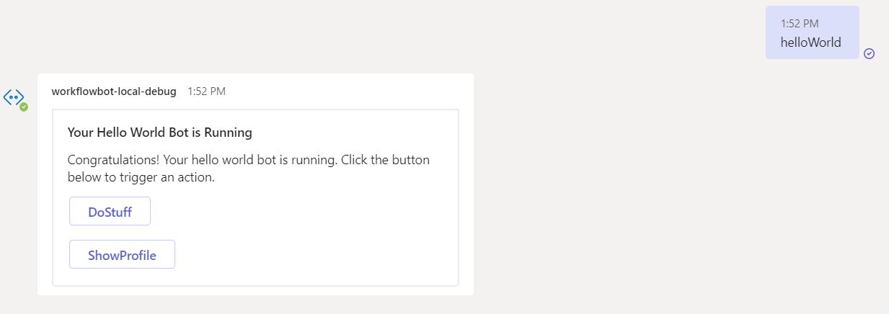

# How to run this sample
1. Clone this repo
   ```
   git clone https://github.com/SLdragon/bot-sso-action-card
   ```

2. Open it in VSCode (with Teams Toolkit 4.x.x installed)

3. Click F5 to view result

    - Input `helloWorld` and it will response an adaptive card with `ShowProfile` button

      

    - Click ShowProfile, it will ask user to consent

    - If consent success, it will show the user profile card
    
      


# Current limitation
- SSO adaptive card is not officially supported by Teams Toolkit team, so there is a sdk folder with modified teamsfx sdk to make it work
- Group chat is not supported


# Recommended reference
- Feature for universal sso card action now is GA, the document can be found here: https://learn.microsoft.com/en-us/microsoftteams/platform/task-modules-and-cards/cards/universal-actions-for-adaptive-cards/enable-sso-for-your-adaptive-cards-universal-action

- Recommended to try this sample for better sso experience: https://github.com/OfficeDev/Microsoft-Teams-Samples/tree/main/samples/bot-sso-adaptivecard/nodejs
